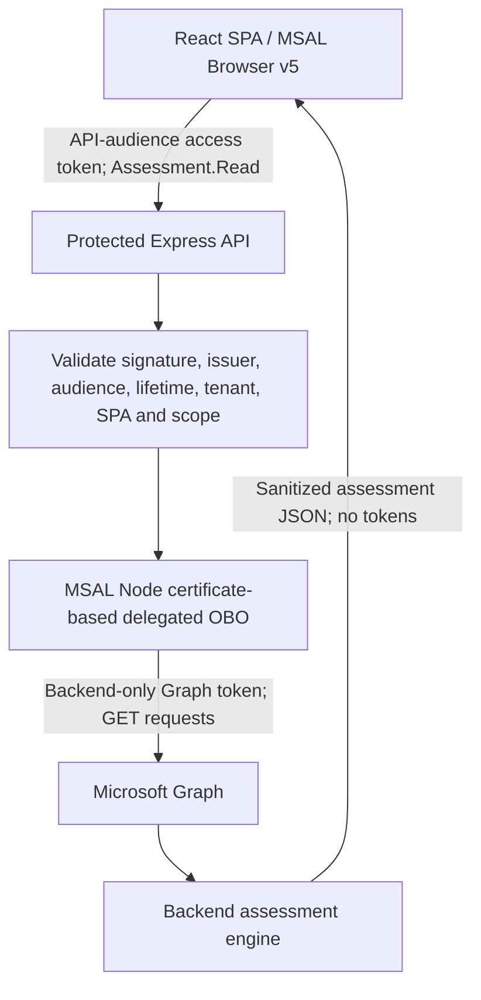

# Microsoft 365 Tenant-Sicherheitsdashboard

Nur lesendes Dashboard zur Bewertung von Microsoft 365: React, TypeScript und Vite zeigen die vom Node.js-/Express-Backend ermittelten Sicherheitsbefunde an. Die Anwendung ver?ndert keine Tenant-Einstellungen.

## Deutsch / English

**Deutsch ist die Standardsprache.** Die Schaltfl?chen **DE | EN** im Kopfbereich wechseln sofort zwischen Deutsch und Englisch. Die Auswahl wird ausschlie?lich als `de` oder `en` unter `krn.dashboard.language` in localStorage gespeichert. Fehlende oder ung?ltige Werte f?hren zu Deutsch; bei gesperrtem Speicher funktioniert der Wechsel f?r die laufende Sitzung.

Ein Sprachwechsel f?hrt weder zu Anmeldung, Autorisierung, neuer Bewertung noch Datenabruf. Interne Werte `PASS`, `WARN`, `FAIL`, `N/A`, Schweregrade, Regel-IDs und s?mtliche Nachweise bleiben unver?ndert. Die deutsche Anzeige lautet **BESTANDEN / WARNUNG / FEHLGESCHLAGEN / NICHT PR?FBAR**. Tenant-Namen, UPNs, Dom?nen, Richtliniennamen, URLs, Zahlen, Zeitstempel und JSON-Nachweise werden nicht ?bersetzt. Microsofts eigene Anmeldeseiten bestimmen ihre Sprache selbst; MSAL-Parameter bleiben unver?ndert.

## Architektur und Umfang

React SPA ? Token f?r die eigene API (`Assessment.Read`) ? gesch?tzte Express-API ? zertifikatbasiertes On-Behalf-Of (OBO) ? Microsoft Graph (nur GET) ? Backend-Pr?fregeln ? Dashboard.

Das Backend pr?ft Signatur, Aussteller, Zielgruppe, G?ltigkeit, Tenant, aufrufende SPA und delegierten Scope. Die SPA hat keine direkten Graph-Berechtigungen. Zertifikat und privater Schl?ssel bleiben ausschlie?lich beim Backend; Graph-Tokens werden nicht an React zur?ckgegeben.

**10 Scanner-Pr?fungen** bewerten Tenant-Metadaten, Benutzer, G?ste, Rollen, globale Administratoren, Conditional Access, Defender-Verf?gbarkeit und lokale Berechtigungskonfiguration. **SEC-001/002 sind separate Microsoft-Auswertungen** und z?hlen nicht in die Scanner-Summe. Fehlende oder unbrauchbare Daten ergeben `N/A`, niemals automatisch `PASS` oder einen erfundenen Secure Score von null.

## Einrichtung und Start

Voraussetzungen: Node.js 24, npm, zwei separate Single-Tenant-Registrierungen, erforderliche delegierte Einwilligungen sowie ein g?ltiges RSA-Zertifikat mit passendem PEM-PKCS#8-Schl?ssel au?erhalb des Projektordners. Rollen und Lizenzen beeinflussen die Datenverf?gbarkeit.

1. Abh?ngigkeiten installieren: jeweils `npm ci` in `backend` und `frontend`.
2. Eine neue Installation gem?? [ENTRA_SETUP.md](ENTRA_SETUP.md) einrichten. Die bereits validierte Tenant-Konfiguration nicht erneut ?ndern.
3. Lokale Umgebungsdateien anlegen. Nur Variablennamen, keine Werte:

| Datei | Variablennamen |
| --- | --- |
| `frontend/.env` | `VITE_CLIENT_ID`, `VITE_TENANT_ID`, `VITE_API_SCOPE` |
| `backend/.env` | `ENTRA_TENANT_ID`, `ENTRA_API_CLIENT_ID`, `ENTRA_SPA_CLIENT_ID`, `ENTRA_CERTIFICATE_PATH`, `ENTRA_PRIVATE_KEY_PATH`, optional `PORT` |

Keine Zugangsdaten in `VITE_`-Variablen. Keine Client Secrets. Die Zertifikatsrotation und manuelle Entra-Einrichtung sind im technischen Abschnitt und in ENTRA_SETUP beschrieben.

In zwei Terminals vom Projektverzeichnis aus:

```powershell
cd backend
npm run dev
```

```powershell
cd frontend
npm run dev
```

Frontend: `http://localhost:5173`, Backend: `http://localhost:5000`. Vite leitet `/api` an Express weiter. In der Oberfl?che **Mit Microsoft anmelden ? Zugriff autorisieren ? Bewertung starten** w?hlen. `npm run preview` ersetzt nicht den eingerichteten Entwicklungsproxy.

## Pr?fung und ?bergabe

In **beiden** Anwendungsordnern ausf?hren:

```powershell
npm test
npm run lint
npm run build
```

Die Lokalisierung liegt zentral in `frontend/src/i18n/`, ohne zus?tzliche Laufzeitabh?ngigkeit. Englische Anwendungstexte dienen als ?bersetzungsschl?ssel; bekannte dynamische Backend-Meldungen werden ausschlie?lich f?r die Darstellung ?bersetzt. Die API und Pr?fregeln bleiben unver?ndert. Neue Anwendungstexte ben?tigen einen Katalogeintrag; unerwartete zuk?nftige Backend-Texte bleiben im Original, statt einen ?bersetzten Befund zu erfinden.

Siehe [PERMISSION_MATRIX.md](PERMISSION_MATRIX.md), [ACCEPTANCE_TESTS.md](ACCEPTANCE_TESTS.md), [MILESTONE.md](MILESTONE.md) und das deutschsprachige Pr?sentationsskript [DEMO.md](DEMO.md).

Der Projektverantwortliche meldete am 2026-09-23 eine erfolgreiche Live-OBO-Bewertung nach Bereinigung der SPA-Graph-Einwilligungen: **10 Pr?fungen, PASS 2 / WARN 7 / FAIL 0 / N/A 1**. Defender lieferte HTTP 403 und korrekt `N/A`. Dies ist ein historischer Live-Bericht, kein garantiertes Ergebnis jeder Bewertung.

## Fehlerbehebung und Grenzen

- API 401: API-Zielgruppe, Sitzung und Konfiguration pr?fen; bei Bedarf erneut anmelden. Keine Graph-Tokens als API-Anmeldung verwenden.
- Graph 403 / nicht pr?fbar: delegierte Backend-Berechtigung, Einwilligung, Benutzerrolle und Dienst/Lizenz pr?fen. Die genaue Ursache wird aus 403 nicht abgeleitet; keine direkten SPA-Graph-Berechtigungen erg?nzen.
- Graph 429: angegebenes Retry-After beachten; Wiederholungen sind begrenzt. Fehlende Secure Score-Daten bleiben nicht pr?fbar.
- Ein Sprachwechsel bei gesperrtem localStorage funktioniert weiterhin, ?berlebt dann jedoch keine Aktualisierung.
- Die Bewertung ersetzt weder eine vollst?ndige Sicherheitszertifizierung noch eine PIM-/Gruppenaufl?sung oder Simulation effektiver Conditional Access-Anmeldungen. SEC-002 liefert abgeleitete Verbesserungskandidaten, keinen verbindlichen Portal-Workflowstatus. Produktionsh?rtung und interaktive Claims-Challenges bleiben au?erhalb des Umfangs.
- Nachweise k?nnen personenbezogene Tenant-Daten enthalten. Nicht unredigiert ver?ffentlichen. Nur gepr?ften Quellcode ?bergeben: keine `.env`-Dateien, Schl?ssel, Zertifikate, Tokens, Caches, `node_modules` oder `dist`. `.gitignore` sch?tzt keine ZIP-Archive, erzwungenen Git-Adds oder bereits verfolgten Dateien.
- Das KRN-Design verwendet Marineblau/Gold; ohne Originaldatei `frontend/public/krn-logo.png` erscheint die Textmarke.

## English technical reference

The dashboard supports **Deutsch / English**, defaults to German, and stores only the language preference in localStorage. Switching languages does not call authentication or assessment APIs. The detailed existing technical reference follows; English button names apply when EN is selected. Its original delivery counts are historical; current localization verification is recorded in ACCEPTANCE_TESTS.md.

### Project purpose

A read-only Microsoft 365 assessment dashboard built with React, TypeScript, Vite, Node.js, and Express. It presents tenant metadata, identity and Conditional Access findings, Defender incident availability, and Microsoft Secure Score evidence without changing tenant configuration.

The dashboard contains **10 scanner checks** with PASS / WARN / FAIL / N/A statuses and **2 separate Microsoft readouts**. Filters, finding details, recommendations, evidence, sources, timestamps, loading feedback, and sanitized errors support review. Microsoft Secure Score never contributes to scanner status totals. N/A means **Not Checkable**, not a passing result.

## Delivery status

On **2026-09-23**, the project owner reported successful live certificate-based OBO validation after removing all six direct Graph permissions from the SPA and revoking their old enterprise-application consent. A clean sign-out/sign-in followed by an assessment succeeded: **10 scanner checks; PASS 2, WARN 7, FAIL 0, N/A 1**. Microsoft Secure Score remained separate. Defender incidents returned HTTP 403 and correctly produced N/A. This is a reported live snapshot, not a fixed expected result for every tenant or an independently rerun live assessment.

See [MILESTONE.md](MILESTONE.md) for history, [PERMISSION_MATRIX.md](PERMISSION_MATRIX.md) for permission ownership, [ENTRA_SETUP.md](ENTRA_SETUP.md) for registration/certificate instructions, and [ACCEPTANCE_TESTS.md](ACCEPTANCE_TESTS.md) for traceable implementation and verification evidence.

The dashboard uses KRN navy/gold styling based on the supplied company reference; semantic status colors remain distinct. The original logo can be added at `frontend/public/krn-logo.png`. Until that original file is present, an accessible text KRN brand mark is displayed. No official logo asset or exact brand-guide color values were inferred or recreated from the chat image.

## Architecture



- **Frontend:** signs users in using the preserved popup flow and MSAL v5 redirect bridge. The SPA's only resource API permission is backend `Assessment.Read`; OpenID sign-in scopes are not direct Graph permissions.
- **Backend:** accepts v2 access tokens for its own client ID, not Graph tokens or ID tokens. It also validates the authorized SPA (`azp`) and required delegated scope. OBO preserves the signed-in user's delegated access.
- **Graph service:** GET-only, safe `@odata.nextLink` paging, one forced renewal on 401, bounded 429 retries honoring Retry-After, and N/A on unusable data. OAuth token exchange uses Entra's token endpoint; it is not a Graph write operation.
- **API:** `GET /api/assessment` is protected. `GET /api/health` is intentionally public and returns minimal health status. Responses are `no-store`; raw authentication/provider errors are not returned or logged.
- **Development:** frontend `http://localhost:5173`, backend `http://localhost:5000`. Vite proxies `/api` to Express. CORS permits only the local frontend origin; it is not a substitute for authentication.

| Location | Responsibility |
| --- | --- |
| `frontend/src/authConfig.ts`, `main.tsx`, `redirect.html` | SPA sign-in and redirect bridge |
| `frontend/src/api.ts`, `Dashboard.tsx`, `dashboardModel.ts` | API client, dashboard, filters and separate summary counts |
| `backend/src/auth.ts`, `config.ts`, `obo.ts` | Token validation, configuration and confidential-client OBO |
| `backend/src/app.ts`, `server.ts` | Express routes and sanitized HTTP boundary |
| `backend/src/graph.ts` | Delegated read-only Graph endpoints, paging and retries |
| `backend/src/assessment.ts`, `conditionalAccess.ts`, `securityChecks.ts` | Rule engine |
| `backend/src/contracts.ts` | Type-only response contract shared with the frontend |

## Prerequisites

- Node.js **24** and npm; use the committed lockfiles for reproducible installs.
- A Microsoft Entra tenant with separate single-tenant SPA and backend API registrations.
- An authorized administrator to configure registrations and grant the two sets of delegated consent for a new deployment.
- A supported signed-in user role and relevant service licenses. Permission consent alone does not guarantee every Graph endpoint is available.
- A valid RSA certificate registered on the backend app, plus the matching PEM PKCS#8 private key stored outside the repository/frontend. OpenSSL 3 is useful for creating a local-development certificate if needed.
- Network access to Microsoft sign-in/JWKS endpoints and Microsoft Graph. Tests use synthetic keys and mocked Graph/OBO, so no tenant access is required for those tests.

## Install and configure

From the project root:

```powershell
cd backend
npm ci
cd ../frontend
npm ci
```

Keep both folders together: the frontend imports the backend's response contract as a TypeScript type only. There is no root npm package.

Create local `.env` files if setting up a new checkout. **Variable names only are listed below.** Obtain actual identifiers, scope and paths from your authorized local setup; never copy credentials into documentation. Existing validated configuration does not need to be replaced.

| File | Variable name | Meaning |
| --- | --- | --- |
| `frontend/.env` | `VITE_CLIENT_ID` | Existing SPA's public client identifier |
| `frontend/.env` | `VITE_TENANT_ID` | Public tenant identifier |
| `frontend/.env` | `VITE_API_SCOPE` | Complete backend scope copied from Expose an API |
| `backend/.env` | `ENTRA_TENANT_ID` | Backend's permitted tenant identifier |
| `backend/.env` | `ENTRA_API_CLIENT_ID` | Backend API client identifier and expected token audience |
| `backend/.env` | `ENTRA_SPA_CLIENT_ID` | Permitted calling SPA client identifier |
| `backend/.env` | `ENTRA_CERTIFICATE_PATH` | Absolute path to the public PEM certificate |
| `backend/.env` | `ENTRA_PRIVATE_KEY_PATH` | Absolute path to its matching private PEM key |
| `backend/.env` | `PORT` | Optional backend port; keep it aligned with the Vite proxy |

The frontend variables are public build-time settings. **No credential may use a `VITE_` variable.** Do not store tokens in environment files. No client secret or client-secret fallback is supported. Restart the relevant process after changing configuration. Vite builds can contain public identifiers; build output is not source-delivery material.

### Entra registrations for a new deployment

Follow [ENTRA_SETUP.md](ENTRA_SETUP.md) for exact portal steps. Preserve the working tenant configuration when using the validated installation.

1. Keep the SPA single-tenant with its SPA redirect URI `http://localhost:5173/redirect.html` and working redirect bridge.
2. Use a separate single-tenant backend registration in the same tenant. Set `api.requestedAccessTokenVersion` to `2`; no backend interactive redirect is required.
3. Under backend **Expose an API**, use the portal-approved Application ID URI and create the enabled, admin-consent-only delegated scope **Assessment.Read**. Copy the full scope from the portal to the frontend's scope setting.
4. Grant the SPA **only Assessment.Read** as its resource API permission. Grant admin consent for SPA-to-backend access.
5. Configure the backend's six **delegated**, read-only Graph permissions from [PERMISSION_MATRIX.md](PERMISSION_MATRIX.md), and separately grant backend-to-Graph admin consent. Do not add application Graph permissions or write permissions.
6. Upload only the public certificate to the backend registration. Keep the matching private key local to the backend.

The validated SPA has already had all six direct Graph permissions removed and old grants revoked. **Do not re-add them to resolve backend Graph errors.**

### Certificate lifecycle

The existing certificate setup is working. For a new installation, use the manual OpenSSL and upload steps in [ENTRA_SETUP.md](ENTRA_SETUP.md). The backend checks certificate dates and key matching, and derives the SHA-256 thumbprint itself. Never print or upload the private key. Restrict private-key filesystem access to the backend operator/process.

Rotate before expiry: register the replacement public certificate, update the backend's local file paths, restart and verify OBO, then retire the old Entra credential and private-key file. Remove credentials and local keys when the deployment is decommissioned. This delivery does not generate or rotate credentials.

## Run locally

In one terminal, from the project root:

```powershell
cd backend
npm run dev
```

In a second terminal:

```powershell
cd frontend
npm run dev
```

Open `http://localhost:5173`, sign in, select **Authorize access** if needed, then **Run assessment**. The backend requires valid configuration before it starts. Do not supply Graph tokens manually to the API or log browser authorization headers.

For compiled backend execution, use `npm run build` followed by `npm start` from `backend`. Frontend `npm run build` writes `frontend/dist`; production hosting must serve the SPA and redirect page and route `/api` to Express. `npm run preview` is a static preview, not the configured development API proxy; a different preview origin is not permitted by the local CORS policy. Use `npm run dev` for the validated local workflow.

## Tests, lint and builds

Run from the project root:

```powershell
cd backend
npm test
npm run lint
npm run build
cd ../frontend
npm test
npm run lint
npm run build
```

Backend tests include the original 30 rule/transport regressions plus 13 API/OBO tests. Frontend tests cover the API boundary and filtering. See [ACCEPTANCE_TESTS.md](ACCEPTANCE_TESTS.md) for the final execution record and manual evidence. Automated tests do not change Entra configuration or perform live Graph writes.

## Troubleshooting

| Symptom | Check/action |
| --- | --- |
| Backend refuses to start | Check required backend variable names, readable absolute certificate/key paths, RSA key matching and certificate validity. Startup errors are intentionally generic; do not dump `.env` or private keys. |
| Frontend reports missing configuration | Check the three frontend variables locally and restart Vite. Use public SPA identifiers and the full backend scope, not backend credentials. |
| API HTTP 401 | Check API-audience v2 token configuration, tenant, SPA client ID, token lifetime and certificate setup. Sign out/in if necessary; the frontend attempts one silent API-token renewal. Never substitute a Graph token. |
| API HTTP 403 | Verify delegated Assessment.Read consent and the permitted local origin. This differs from a Graph 403 inside an otherwise successful assessment. |
| Individual findings are N/A / Graph HTTP 403 | Check the backend's corresponding delegated permission, admin consent, caller role and service availability. Current live Defender 403 is accurately recorded as N/A; its exact cause is unproven. |
| Graph HTTP 429 | Honor the reported retry delay. The transport retries at most twice per page; waits above 30 seconds are reported for a later manual retry. |
| Empty or stale Secure Score | Keep N/A; do not replace it with zero. The current implementation uses a documented 72-hour project freshness threshold. |
| Popup or redirect does not finish | Confirm the exact registered SPA redirect and retain `frontend/redirect.html` plus its Vite build entry. Do not replace the MSAL v5 bridge with a regular React route. |
| Backend connection unavailable | Start both processes from their respective folders; confirm port alignment and the `/api` Vite proxy. |
| Build warns about `__dirname` | Existing nonblocking Vite future-native-config-loader warning; not a TypeScript or build failure. |

## Repository and delivery protection

Ignore rules in the root and both applications cover environment files/backups, certificates, private keys, common token/secret/cache files, dependency folders and generated builds. Their behavior is verified against synthetic filenames without reading credential contents; see [ACCEPTANCE_TESTS.md](ACCEPTANCE_TESTS.md).

**`.gitignore` is not a guarantee against committing secrets:** force-adds bypass it, tracked files remain tracked, and sensitive content can be pasted into an ordinary source file. No Git repository is initialized in the inspected root/frontend/backend, so an index/history audit cannot currently be completed. Before an actual commit, inspect staged filenames and run `git ls-files -ci --exclude-standard` locally for already-tracked ignored files; use a suitable secret scanner without printing findings' secret values. Rotate exposed credentials if any were previously committed. Do not distribute the whole working directory as a ZIP: Git ignore rules do not protect archives. Deliver reviewed source and lockfiles without `.env`, key/certificate files, caches, tokens, `node_modules`, or `dist`.

## Security limitations

- Findings reflect returned evidence and caller visibility, not a complete security/compliance certification. APP-001 checks local scanner scope configuration; it does not audit actual Entra grants.
- The scanner does not expand PIM-eligible/group-based role assignments or simulate effective Conditional Access during sign-in. Exclusion ownership/approval and emergency-access readiness require manual review.
- SEC-002 derives improvement candidates from dated scores and control profiles; it does not establish authoritative Defender portal workflow status. Secure Score is always separate from scanner counts.
- Missing permissions, roles, licenses, partial pages, unknown fields and empty security collections can prevent assessment. A 403 does not conclusively identify the cause; unavailable data never proves safety.
- Downstream interactive claims-challenge propagation is not implemented; those failures are sanitized and reported as unavailable.
- This local-development delivery is not a hardened public deployment. Production needs HTTPS, explicit deployment origins/routing, secure key storage and rotation, operational abuse/concurrency controls, and further end-to-end validation.
- Tokens exist transiently in MSAL/session or backend memory. Evidence contains tenant/user information; treat it as sensitive and do not attach unredacted assessment output to public reports.
